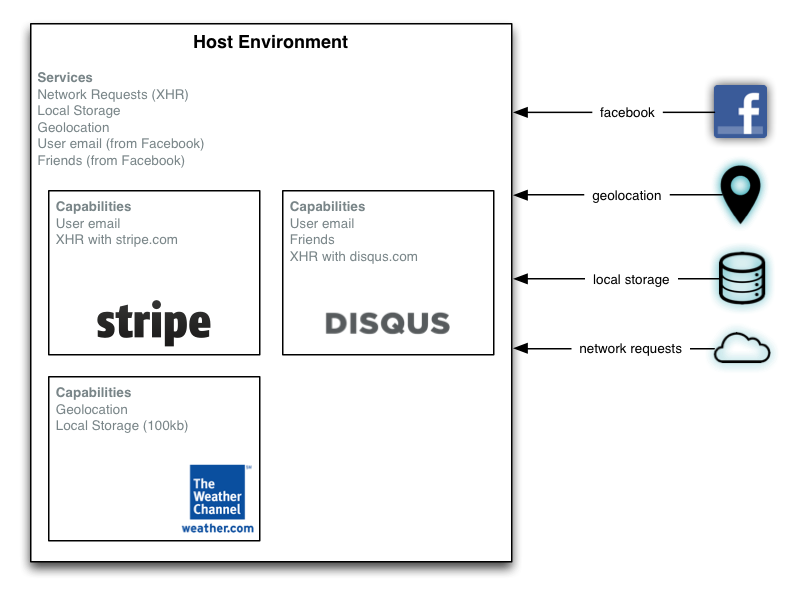
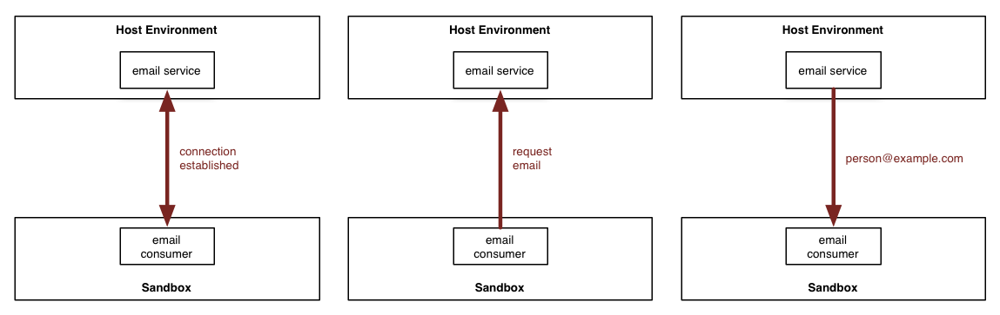

# Introduction to Oasis.js

Oasis.js is a library for allowing embedded third-party code to securely
communicate with a host environment.

For example, imagine you are writing a web application that integrates with
the Facebook OAuth API. As part of the authentication process, Facebook will
grant you permission to access certain capabilities, like posting to the
user's timeline or accessing the user's e-mail address.

You may want to embed third-party code that adds functionality to your
application, and give it access to the user's email address, but not to post
to their timeline. You may also want to embed code that you trust, and give it
permission to post to the user's timeline, but not necessarily completely
unrestricted access to the information and capabilities of the host
environment.

## Example

<center>
  
</center>

In this example, the **Host Environment** is a standard web page, with  access
to browser capabilities like *Geolocation*, *Local Storage*, and
*XMLHttpRequest*. It also has requested access to capabilities from Facebook
on behalf of the user.

The Host Environment would like to embed several components in the page, and
delegate its capabilities to those components. For example, it wants Stripe to
have access to the user's email address, so it can auto-fill its form, as well
as the ability to make a network request to Stripe.com.

It wants to give an embedded Weather.com component access to the user's location,
so it can display localized weather information, as well as a limited amount of
storage for caching results.

Finally, the Host Environment wants to embed a Disqus component for comments,
and give it access to the user's email address, so the widget can customize
its greeting. It wants to grant the component access to the user's friends, so
it can highlight comments by those friends. And it wants to allow the
component the ability to make network requests to Disqus.com.

## How It Works

An Oasis.js **Service** allows a web page to one or more embedded components.

For example, to provide the user's email to a sandbox, a Host Environment would
create a service that looks like this:

```javascript
var EmailService = Oasis.Service.extend({
  requests: {
    email: function() {
      // the application has previously saved off the user's
      // Facebook details in `facebookDetails`.
      return facebookDetails.email;
    }
  }
});
```

Now that we've defined the email service, we will create a sandbox that can
consume that service:

```javascript
Oasis.createSandbox('http://www.example.com/stripe.payments.js', {
  services: { email: EmailService }
})
```

Now let's look at what `stripe.payments.js` would look like:

```javascript
var EmailConsumer = Oasis.Consumer.extend({
  initialize: function() {
    this.request('email').then(function(email) {
      // asynchronously receive the email here
    });
  }
});

Oasis.connect({
  consumers: { email: EmailConsumer }
});
```

Here, we are setting up the other side of the connection that the service
defined in the Host Environment. When the connection is established, the
consumer requests the user's email from the Host Environment.



## Geolocation Service

Let's take a look at how you would implement a geolocation service.
In this case, the Host Environment has direct access to geolocation,
but the sandboxed component is disallowed from asking for the user's
location.

First, let's build a service that exposes a request for the current
geolocation:

```javascript
var GeolocationService = Oasis.Service.extend({
  requests: {
    currentLocation: function(resolver) {

    }
  }
});
```